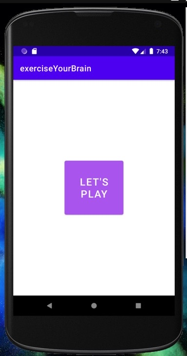
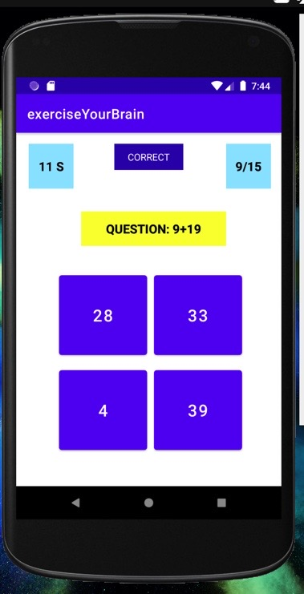
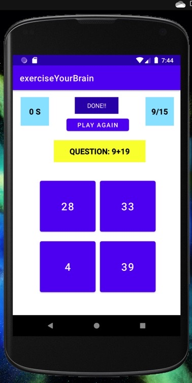

# BrainTrainerApp
## SIMPLE MINI ANDROID PROJECT
#### One has to answer maximum questions in 30 seconds - basic addition questions. 
#### There are random numbers / questions generated everytime and there is score updation as well.
#### There is also a message shown where the answer is correct or not.
#### After the timer elapses one can replay the game by clicking on "Play Again"
### PREVIEW

## What have I learnt while making this app?
- Showing and hiding of UI elements
- Grid Layouts
- Timers
- Random number generation
- Tags
